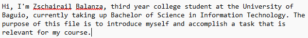
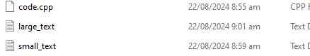
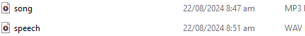
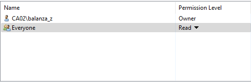
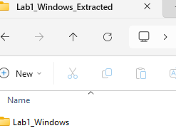

# SYSADM1 -- Introduction to File Systems in Windows and Linux

# Requirement: 

-   A virtual machine running Linux and Windows OS

# Instructions: 

**Part A: Windows File System**

1.  **Open File Explorer:** Click the File Explorer icon on your desktop
    or press the Windows key + E.

2.  **Navigate to your Documents folder:** This is usually the default
    location for user files.

3.  **Create a new folder:** Right-click in an empty space, select
    \"New,\" then \"Folder.\" Name it \"Lab1_Windows.\"

> 

4.  **Create a text file:** Right-click in the \"Lab1_Windows\" folder,
    select \"New,\" then \"Text Document.\" Rename it to \"info.txt.\"


5.  **Open the text file:** Double-click the \"info.txt\" file to open it in Notepad.

6.  
7.  **Type some text:** Write a short
    paragraph about yourself or the purpose of the file.

8.  **Save the file:** Close the Notepad window and save the changes.

9.  
10.  **Create a subfolder:** Create a new
    folder inside \"Lab1_Windows\" called \"Data.\"

11.  **Copy the text file:** Copy the \"info.txt\" file to the \"Data\"
    subfolder.

12. **Rename the copied file:** Rename the copied file to \"data.txt.

> 
11. Create a folder named \"LabFiles\" with subfolders for each file
    type. Use the internet for the resources of the files listed below.

> **LabFiles**

1.  **Text**

    1.   large_text.txt

    2.  small_text.txt

    3.  code.cpp

2.  **Images**

    1.  
       image1.jpg

       image2.png

        image3.bmp

3.  
   **Audio**

    1.  song.mp3

    2.  speech.wav

5.  
**Video**

    1.  clip.mp4

```{=html}
<!-- -->
```
12. **Check file properties:** Right-click on the \"info.txt\" file and
    select \"Properties.\" Explore the General, Details, and Security
    tabs to understand file attributes like creation date, size, and
    read-only status.

13. **Change file attributes:** Try changing the file attributes (e.g.,
    read-only, hidden) using the Properties dialog. Observe the changes
    in File Explorer.

14. 
**Share the folder:** Right-click on
    the \"Lab1_Windows\" folder, select \"Properties,\" and then the
    \"Sharing\" tab. Share the folder with a specific user or group,
    setting appropriate permissions (e.g., Read, Write, Full control)

15. 
**Create an archive:** Use WinRAR or
    7-Zip to create a compressed archive of the \"Lab1_Windows\" folder.

16. **Extract an archive:** Create a new folder, then extract the
    created archive into it.


Part B. Create a log report structure
