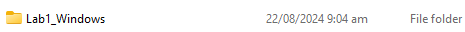
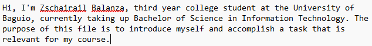
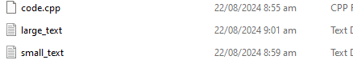
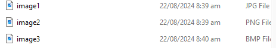
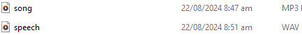
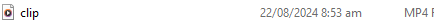
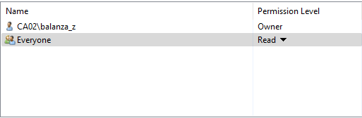
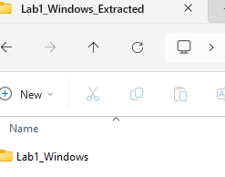

+----------------------------------+------------------------+----------+
| {width="2.4in" |                        |          |
| height="0.5881944444444445in"}   |                        |          |
|                                  |                        |          |
| SCHOOL OF INFORMATION AND        |                        |          |
| TECHNOLOGY                       |                        |          |
+----------------------------------+------------------------+----------+
| NAME: Zschairail Balanza         | DATE PERFORMED:        |  40/50   |
|                                  | 08/22/24               |          |
+----------------------------------+------------------------+----------+
| Section: IDC2                    | DATE SUBMITTED:        |          |
|                                  | 08/22/24               |          |
+----------------------------------+------------------------+----------+

# SYSADM1 -- Introduction to File Systems in Windows and Linux

# Requirement: 

-   A virtual machine running Linux and Windows OS

# Instructions:  {#instructions .list-paragraph}

**Part A: Windows File System**

1.  **Open File Explorer:** Click the File Explorer icon on your desktop
    or press the Windows key + E.

2.  **Navigate to your Documents folder:** This is usually the default
    location for user files.

3.  **Create a new folder:** Right-click in an empty space, select
    \"New,\" then \"Folder.\" Name it \"Lab1_Windows.\"

> {width="1.8805555555555555in"
> height="0.23402777777777778in"}

4.  **Create a text file:** Right-click in the \"Lab1_Windows\" folder,
    select \"New,\" then \"Text Document.\" Rename it to \"info.txt.\"

{width="1.1355752405949255in"
height="0.33338035870516186in"}

5.  **Open the text file:** Double-click the \"info.txt\" file to open
    it in Notepad.

6.  {width="4.252083333333333in"
    height="0.5291666666666667in"}**Type some text:** Write a short
    paragraph about yourself or the purpose of the file.

7.  **Save the file:** Close the Notepad window and save the changes.

8.  {width="1.09375in"
    height="0.3020833333333333in"}**Create a subfolder:** Create a new
    folder inside \"Lab1_Windows\" called \"Data.\"

9.  **Copy the text file:** Copy the \"info.txt\" file to the \"Data\"
    subfolder.

10. **Rename the copied file:** Rename the copied file to \"data.txt.

> {width="1.1980839895013122in"
> height="0.3854702537182852in"}

11. Create a folder named \"LabFiles\" with subfolders for each file
    type. Use the internet for the resources of the files listed below.

> **LabFiles**

1.  **Text**

    1.  {width="2.6354166666666665in"
        height="0.4813549868766404in"}large_text.txt

    2.  small_text.txt

    3.  code.cpp

2.  **Images**

    1.  {width="2.8854166666666665in"
        height="0.5047922134733158in"}image1.jpg

    2.  image2.png

    3.  image3.bmp

3.  {width="2.8854166666666665in"
    height="0.3398523622047244in"}**Audio**

    1.  song.mp3

    2.  speech.wav

4.  {width="3.8541666666666665in"
    height="0.20425306211723535in"}**Video**

    1.  clip.mp4

```{=html}
<!-- -->
```
12. **Check file properties:** Right-click on the \"info.txt\" file and
    select \"Properties.\" Explore the General, Details, and Security
    tabs to understand file attributes like creation date, size, and
    read-only status.

13. **Change file attributes:** Try changing the file attributes (e.g.,
    read-only, hidden) using the Properties dialog. Observe the changes
    in File Explorer.

14. {width="2.71875in"
    height="0.5138888888888888in"}**Share the folder:** Right-click on
    the \"Lab1_Windows\" folder, select \"Properties,\" and then the
    \"Sharing\" tab. Share the folder with a specific user or group,
    setting appropriate permissions (e.g., Read, Write, Full control)

15. {width="1.4377001312335957in"
    height="0.27087160979877517in"}**Create an archive:** Use WinRAR or
    7-Zip to create a compressed archive of the \"Lab1_Windows\" folder.

16. **Extract an archive:** Create a new folder, then extract the
    created archive into it.

{width="1.4331485126859143in"
height="1.125in"}Part B. Create a log report structure
